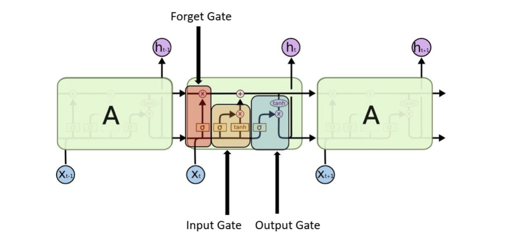
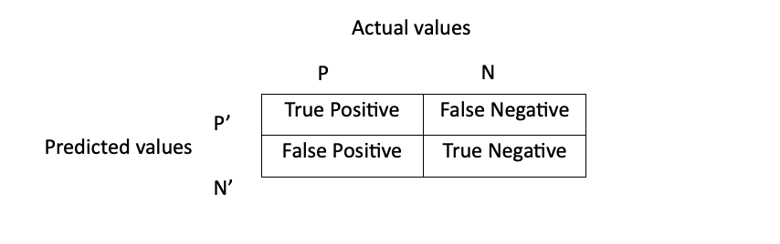

# Human Activity Recognition Using CNN and LSTM RNN Models

## Abstract:

This project focuses on the development and evaluation of Deep Learning models for accurately identifying human physical activities based on accelerometer data collected from smartphones or smartwatches. Specifically, we employ Long Short-Term Memory Recurrent Neural Networks (LSTM RNN) and Convolutional Neural Networks (CNN) to analyze time-series accelerometer data.

The models are trained on a labeled dataset from the International SPHERE competition, where participants wore accelerometer devices while engaging in various physical activities. Subsequently, the models are tested on a separate labeled dataset provided by WISDM to evaluate their generalization capabilities.

Our analysis compares the performance of the LSTM RNN and CNN models in recognizing physical activities using accelerometer data. The evaluation metrics include accuracy and consistency across datasets. Additionally, we leverage Big Data from the UK Biobank, comprising samples from over 100,000 volunteers, to further assess model performance.

The results indicate that the LSTM RNN model outperforms the CNN model in recognizing physical activities from time-series accelerometer data. While both models achieve satisfactory accuracy when tested on the training dataset, their generalization capabilities are limited, as evidenced by decreased accuracy on the separate testing dataset.

Overall, this research contributes to the understanding of Deep Learning approaches for human activity recognition and underscores the importance of addressing generalization challenges in real-world applications. Further details and insights can be found in the Final Year Individual Project Report.

## Chapter 1: Introduction

**1.1 Background**

In recent years, wearable technology has undergone significant advancements, particularly in the realm of health monitoring. Devices such as smartwatches and smartphones, equipped with sensors like accelerometers, have become ubiquitous tools for collecting data on human activities. This passive data collection offers immense potential for enhancing medical diagnosis and monitoring by providing continuous insights into individuals' physical, mental, and cognitive health.

**1.2 Problem Statement**

Despite the promise of wearable devices in gathering rich datasets, a significant challenge persists in effectively translating this data into actionable information for medical professionals. Traditional diagnostic methods often rely on subjective self-reports from patients, which may be incomplete or biased. Consequently, there is a pressing need for robust and accurate methods to interpret accelerometer data and extract meaningful insights for healthcare practitioners.

**1.3 Aim and Scope**

This major project aims to evaluate and compare the performance of two deep learning neural network models—Convolutional Neural Network (CNN) and Long Short-Term Memory (LSTM) Recurrent Neural Network (RNN)—in recognizing human activities using time series accelerometer data obtained from wearable devices. The accelerometer data collected from wearable devices serves as the passive data for this project. It measures acceleration along three different axes: X-axis (left to right), Y-axis (top to bottom), and Z-axis (front to back), with acceleration measured in units of g (where 1 g = 9.81 m/s²). Although data is collected at varying rates across different devices, for the purpose of training the classifier, the supplied data is sampled at 20Hz. However, when utilizing new datasets for testing the algorithm’s performance, data will be downsampled to 20 Hz to ensure consistency. The primary goal is to accurately classify the physical activity of individuals based on accelerometer data captured while they wear the device.

**1.4 Significance and Contributions**

Our research offers valuable insights that can lead to important changes in how we understand and approach medical diagnosis. By comparing two different types of neural network models—CNNs and LSTM RNNs—we aim to provide clear evidence of which model works better for recognizing human activities from accelerometer data. Additionally, our study uses a large dataset from the UK Biobank, which includes information from thousands of people. Through our work, we hope to provide practical knowledge that can improve the accuracy and reliability of systems designed to recognize human activities. These findings have the potential to make a meaningful impact in both academic and healthcare settings, paving the way for better diagnostic tools and practices.

This introductory chapter has provided a comprehensive overview of the background, problem statement, aim, scope, and significance of the major project on Human Activity Recognition using CNN and LSTM RNN. Subsequent chapters will delve deeper into the methodology, experimentation, results, and discussion to fulfill the objectives outlined in this introduction.

## Chapter 2: Literature Review

Human activity recognition has attracted considerable interest in research, particularly in the development of machine learning algorithms capable of accurately identifying various physical activities in real-time settings. This chapter provides a comprehensive overview of previous studies conducted in this field, highlighting the evolution of techniques and methodologies.

**2.2 Feature Extraction Techniques**

In [5], authors explored advanced feature extraction methods beyond basic statistical and spatial features present in accelerometer data. By leveraging the first-order derivative of acceleration signals and employing classifiers like boosted decision stumps, support vector machines, and regularized logistic regression, they achieved improved classification accuracies.

In [6], a novel Haar-like filtering technique was proposed, demonstrating high accuracy in feature extraction from 3D acceleration signals. This method significantly reduced feature extraction costs and model redundancy, showcasing promising results for HAR applications.

**2.3 Wearable Devices and Data Collection**

Addressing privacy concerns associated with computer vision-based approaches, [7] utilized a single wearable device, the Microsoft Band 2, for data collection. Employing decision tree classifiers, they achieved a high overall accuracy of 90% in HAR tasks, emphasizing the universality and practicality of wearable devices for data acquisition.

In contrast, [8] leveraged smartphone accelerometers for HAR, employing support vector machines and real-time tracking on Android phones. Their model achieved a remarkable accuracy of 93.38%, showcasing the potential of smartphones as ubiquitous sensing platforms for HAR.

**2.4 Wearable Device-Based Approaches**

Privacy concerns associated with video surveillance prompted researchers in [7] to adopt a single wearable device approach using a Microsoft Band 2. Through decision tree classifiers, they achieved a high overall accuracy of 90% in classifying human activities.

**2.5 Smartphone Sensor Utilization**

Contrary to wearable sensors, [8] utilized smartphone accelerometers for activity classification using support vector machines. By extracting multiple features and employing real-time processing on Android phones, their model attained an impressive accuracy of 93.38%.

**2.6 Emergence of Deep Learning Models**

The rise of deep learning algorithms, particularly Convolutional Neural Networks (CNNs) and Long Short-Term Memory Recurrent Neural Networks (LSTM RNNs), has revolutionized activity recognition. Research in [9] showcased the superior performance of LSTM RNNs compared to traditional machine learning models.

**2.7 Utilization of CNN and LSTM RNN Architectures**

Studies in [10] and [11] demonstrated the effectiveness of CNN and LSTM RNN architectures in classifying human activities using accelerometer data from smartphones. In [10], researchers transformed the x, y, and z-axis data into a single vector magnitude using the Euclidean norm formula to enhance the robustness of the classification process.

**2.8 Enhancements in Model Performance**

To address computational complexity and speed concerns, researchers in [14] proposed multi-layer parallel LSTM RNN models, achieving high accuracies while reducing computational complexity. Additionally, [15] explored data parallelism techniques on cloud computing platforms, resulting in significant computational time savings.

This literature review underscores the diverse methodologies and advancements in HAR research, spanning from feature extraction techniques to deep learning approaches and scalability enhancements. By synthesizing insights from previous works, this chapter sets the stage for the subsequent analysis and development of novel HAR methodologies in this major project.

## Chapter 3: Approach and Methodology

**3.1 Data Collection and Preprocessing**

Collection of SPHERE Competition Dataset: The labelled dataset provided by the SPHERE competition, consisting of accelerometer data capturing human physical activities, will be obtained for training and validation purposes.
Preprocessing of SPHERE Dataset: The collected dataset will undergo preprocessing steps such as normalization, noise removal, and feature extraction to prepare it for training the classifiers.
Acquisition of WISDM Dataset: Additionally, the WISDM dataset, comprising accelerometer data from a different source, will be acquired for testing the trained models on unseen data.

**3.2 Model Development**

Convolutional Neural Network (CNN) Development: A CNN model will be designed and implemented for human activity recognition using the accelerometer data. The architecture of the CNN will consist of convolutional layers, pooling layers, and fully connected layers.
Long Short-Term Memory Recurrent Neural Network (LSTM RNN) Development: An LSTM RNN model will be constructed to recognize human activities based on time series data. The LSTM architecture will include memory cells to capture temporal dependencies in the data.

**3.3 Training and Validation**

Training of CNN and LSTM RNN: The developed CNN and LSTM RNN models will be trained on the labelled dataset from the SPHERE competition. This process involves adjusting the model parameters using backpropagation and gradient descent to minimize the classification error.
Validation of Trained Models: The trained models will be validated using a separate portion of the SPHERE dataset not used during training. This validation step ensures that the models generalize well to unseen data and evaluate their performance metrics such as accuracy, precision, and recall.

**3.4 Testing on Unseen Data**

Application of Trained Classifiers on WISDM Dataset: The optimized CNN and LSTM RNN classifiers will be applied to the WISDM dataset to predict human activities. This testing phase evaluates the generalization capability of the models to data from a different source.
Comparative Analysis: The performance of each classifier on the WISDM dataset will be compared to determine which model performs better in recognizing human activities from accelerometer data.

**3.5 Analysis and Interpretation of Results**

Evaluation Metrics: Various evaluation metrics such as accuracy, F1 score, and confusion matrices will be used to assess the performance of the CNN and LSTM RNN models.

Comparison of Models: The results obtained from testing on the WISDM dataset will be analyzed to compare the effectiveness of the CNN and LSTM RNN classifiers in recognizing human activities.
Interpretation of Findings: The findings will be interpreted to understand the strengths and weaknesses of each model and whether the theoretical belief regarding the superiority of LSTM RNN models for time series data holds true.
By following these steps outlined in the approach and methodology, this study aims to develop, train, validate, and test deep learning models for accurate human activity recognition using accelerometer data.

## Chapter 4: Datasets

**Chapter 5: Theoretical Background**

Convolutional Neural Networks (CNNs):
Convolutional Neural Networks are a type of neural networks primarily employed for image recognition tasks. They utilize the concept of local receptive fields to identify specific features within the input image, aiding in its classification among a set of diverse images. CNNs consist of multiple layers including the pooling layer, non-linearity layer, convolutional layer, and fully connected layer [16]. The term "convolutional" originates from the mathematical operation of convolution, where two functions combine to generate a third function. In this context, the input is convolved with a filter comprising trainable weights, which are adjusted using backpropagation, ultimately producing a feature map.

The convolutional layer contains parameters (weights), whereas layers like pooling and fully connected layers do not [16]. This characteristic significantly enhances the performance of CNNs compared to traditional artificial neural networks by reducing the overall number of parameters. Structurally, a CNN comprises three main layers:

Convolutional Layer: This layer is responsible for extracting essential features such as edges from the input image. As the network deepens, it identifies more complex features like shapes and digits [17]. It consists of two matrices: one representing a selected portion of the input data and the other representing a filter/kernel, which comprises learnable parameters. The kernel slides over the input data, producing a feature matrix with reduced dimensions and clearer features compared to the original input.

Pooling Layer: The primary function of this layer is to progressively reduce the size of the feature matrix, thereby reducing computational complexity. It aggregates dominant features within sections of the feature matrix, effectively downsampling the data [17]. This process helps in noise reduction and prevents overfitting by preserving essential features.

Fully Connected Layer: After extracting and reducing the size of features, the image is flattened into a single column vector and fed into a feedforward neural network for classification [17]. The fully connected layers enable the establishment of non-linear dependencies within the network.

Activation Functions:
Activation functions play a crucial role in neural networks by introducing non-linear transformations to the linear mappings between inputs and outputs [18]. They aid in predicting the most probable category by assigning probabilities to each output category. The three commonly used activation functions include sigmoid, Tanh (hyperbolic tangent), and ReLU (Rectified Linear Unit). ReLU has gained popularity due to its simplicity and effectiveness:

𝐼𝑓 𝑥 < 0: 𝑅(𝑥) = 0	 ...(1)

𝑖𝑓 𝑥 ≥ 0: 𝑅(𝑥) = x  ....(2)

This formula represents the ReLU activation function, which returns 0 for negative input values and returns the input itself for non-negative input values.

 
This shows that the gradient of the graph of the function at any point will be either 0 or 1. At no point can the gradient saturate, hence this activation function avoids the vanishing gradient problem. Although the one negative aspect is that if a certain neuron never gets activated for any given input, the gradient will always be zero for it and a dead gradient problem may occur.
The limitation with the rectified linear unit activation function is that it should only be used within the hidden layers of a neural network. Hence, for the last output layer of the convolutional neural network a Soft-max layer is used. The softmax function is able to convert the output of the last linear layer of a multi-class neural network into probabilities of which class is most likely to be the correctly predicted one [19]. It produces a probability distribution of the predicted classes – the sum of which should add up to one.
When the three main layers – convolution layer, pooling layer and fully connected layer – are combined with an activation function and a softmax layer, the whole process of taking inputs first into the convolutional layer to getting the output at the output layer is called forward propagation. Each individual layer is given the input from the previous layer and processes it as per the activation function and passes each output to the next successive layer. Feed forward networks are important for forward propagation; in order for an output to be generated, it is imperative that no data is fed backwards in the network during the output generation cycle [20]. This takes place at each neuron in a hidden or output layer in two steps: pre-activation phase and activation phase.

At the pre-activation phase, the weighted sum of inputs – the linear transformation of the weights with regards to the inputs is available [20]. This aggregated sum is then taken and based on the activation function the neuron decides if this information is to be passed on or not. This calculated sum of weights is then transmitted to the activation phase where non-linearity is added to the network based on the mathematical function of the activation function.

The neural networks use a random value of weights when they are first initialised. This might seem counter-intuitive, but in supervised learning it is not where you start off in terms of the weight initialisation of the neurons within each layer. If the network is trained enough times and the classifier is robust and pervasive enough, eventually the correct weights are reached. These weights of each neuron within each layer have to be constantly updated and this is done through backward propagation.

Once there is an output from the network in one iteration, the output is compared to the actual value. This is done by the loss function – a generalizable performance metric that enables the user to understand how close the Neural Network’s prediction is to the Actual output [21]. The aim of the machine learning program is to always minimise this loss function to zero. The gradient of the loss function is used to optimize the values of the internal weights of the network in order to reduce the value of the loss function [21]. This gradient helps the user understand how much the value of the total error will change if we change the weights of the neuron by any small arbitrary value [21]. A positive gradient would point at reducing the size of the weights as at that randomly initialised weight if you increase the weight size, the total error would increase. A negative gradient would point at increasing the weights as at this current randomly initialised weight, the total error is decreasing. The aim is to get to a gradient of 0 after this process of increasing or reducing the size of the weights. This process of finding a minimum is called gradient descent. Appropriate step sizes need to be taken to ensure that the classifier is able to find a global minimum and not a local minimum. Extensive training and the right epoch sizes can ensure that.

As each error is calculated, and each error’s gradient is calculated, this is then sent back to the start of the layers. This backpropagation hence allows the weights to be updated with an appropriate value to ensure the performance of the classifier can be increased. As each weight is updated, it is important to ensure that each change to the weight is minute, as a big change in the weights can cause the behaviour of the neural network to be chaotic [21]. Smaller changes can help in identifying the correct value faster as the trajectory of the neural network can be easily projected and localised. Especially since these neural networks usually have lots of non-linearity, and the current gradient that the network would have is localised at the certain point it is being calculated on, bigger changes to the updated weights would make it very difficult to observe and analyse the results of those updates. The methods using which these weights are updated are called optimizers. A commonly used optimizer is the Adam optimizer – which is a variant of stochastic gradient descent.
Adam is an adaptive learning rate optimization algorithm that’s been designed specifically for training deep neural networks. The algorithm works particularly well because it finds individual learning rates for each parameter through the power of adaptive learning rate methods. Adam can be considered a combination of RMSprop and Stochastic Gradient Descent with momentum [22]. The central idea of RMSprop is keep the moving average of the squared gradients for each weight. And then we divide the gradient by square root the mean square [23]. In Stochastic Gradient Descent, using random probability, the algorithm tries to minimize a certain cost function by moving in the direction of the steepest descent as defined by the negative of the gradient.

The whole process of forward and backward propagation is then repeated a number of times to get to a point where the neural network is adequately trained on the training data to be able to make predictions on similar information. It takes several iterations for the neural network to reach the right parameters to learn [21]. Each iteration is called an epoch. The number of epochs depends on a number of factors: quality of data, learning rate of the algorithm, complexity of the layers, optimization method used, and even the random initialization of the weights.

**5.2 Long Short-Term Memory Recurrent Neural Network**

LSTM RNN are a set of Neural Networks whose functions and way of working is inspired by the human brain. A Recurrent Neural Network differentiates from a normal Artificial Neural Network in the way that it specifically makes use of sequential information. If two images of a cat and dog are fed into an artificial neural network, the ANN will recognize a few patterns and predict an image to be of a dog or a cat. At no point did the ANN’s prediction depend on previous images. Each prediction of a dog or a cat would be based on the image itself and not the data before it.

However, there can be multiple situations where the previous data would be important in terms of making a prediction on the current data. For example, predicting the financial market value of a company’s stocks, predicting the next word in a sentence etc. In such situations, a neural network – like the recurrent neural network – is needed where it can have ‘memory’ to store sequential information and utilize that when making a certain prediction.
In traditional neural networks, it is generally assumed that the input and outputs are independent of each other [24]. But this can become detrimental when, for example, predicting a word in a sentence as mentioned before. The word ‘recurrent’ is used for this neural network because it performs the same task on every element of a sequence of data, with each output being dependent on the previous data [24]. As can be seen from the following photo where 𝑥𝑡 represents the input, A represents the activation function of the hidden layer, and ℎ𝑡 represents the value of the current state.

![Figure 2. How an RNN utilizes its ‘memory’ [24]](./data/images/fig2.png)

Figure 2. How an RNN utilizes its ‘memory’ [24]

There are many different types of RNNs: one to one, one to many, many to one, many to many and bidirectional many to many. Many to one is the kind of RNN where it takes a sequence of multiple data inputs and provides one output of a fixed size. The following photo describes the architecture of a many to one RNN where red arrows represent the inputs and the green and blue arrows represents the outputs of the hidden layers:

![Figure 3. Many to one RNN [24]](./data/images/fig3.png)

Figure 3. Many to one RNN [24]

The weights and biases applied to the hidden layers of an RNN are always the same in order for it to memorize the information processed through them [24].
In Figure 4 below, the formula to find the current state would be the following equation:

ℎ𝑡 = 𝑓(ℎ𝑡–1, 𝑥𝑡)      ...(3)

![Figure 4. Information retention of an RNN [24]](./data/images/fig4.png)

Figure 4. Information retention of an RNN [24]

𝑂𝑡 represents the output state, ℎ𝑡 would be the current time stamp, ℎ𝑡–1 would the previous time stamp and 𝑥𝑡 is passed as the input to the next stage. The tanh activation function is applied within each candidate cell to determine the internal state value and that is then used to update the hidden state’s value. This is described in the following equation:

ℎ𝑡 = tanh (𝑊ℎℎℎ𝑡–1 + 𝑊𝑥ℎ𝑥𝑡)	...(4)

In equation 4 W, is the weight, with 𝑊ℎℎ representing the weights from the previous hidden layer, and 𝑊𝑥ℎ being the weights at the current input state [24]. The tanh activation function is used because it implements a non-linearity where the output values are within the range -1 to 1. Its non-linear nature allows for multiple LSTM layers to be stacked on top of each other. The output at the final stage is described best through the following equation:

𝑦𝑡 = 𝑊ℎ𝑦ℎ𝑡	  ...(5)

In equation (5) 𝑦𝑡 represents the output state and 𝑊ℎ𝑦 represents the weight at the output state.

The LSTM RNN utilizes backpropagation to improve the value of the weights and biases assigned at each layer during the training process to reach a more accurate output state. The loss function helps to calculate the difference between the current output state predicted and the real output state. Mean squared error is a common loss function used. As mentioned in section 3.1, the gradient of the loss function is used to optimize the values of the internal weights to try and reduce the value of the loss function down to zero. As the weights are the same for all hidden layers in a recurrent neural network, the gradient calculated for each time step can be combined together. The weights of the recurrent neuron and the output dense layer can then be updated together.

There are two kinds of problems one can face during backpropagation: vanishing gradient and exploding gradient [24]. In simple words, vanishing gradient is a problem that occurs when the contribution from earlier steps becomes insignificant in the gradient descent step. This can happen when the error between the predicted output and the real output has a partial derivative with respect to the weight that is less than 1. This value is then multiplied with the learning rate – which is already a very insignificant value – causing this final value to be even smaller. Then as the weights are updated using this value, there won’t be any significant changes in the weights and thus the vanishing gradient problem is faced. It causes the RNN to forget the long-term dependencies as those value isn’t fed to the next iterations. Similarly, exploding gradient is the problem where if the partial derivative of the error with respect to the weights is extremely high, a stupidly high value is assigned to the weights and thus the gradient explodes.

These problems are solved by adding LSTM to RNNs: Long Short-Term Memory. Within the LSTM cell states, long term dependencies and relations are encoded in state vectors and it is this cell state derivative that can prevent the LSTM gradients from vanishing [25]. LSTMs consist of three steps: Forget gate, Input gate, Output gate. This is shown in the image below:

Figure 5. Structure of a LSTM cell

- Forget Gate: Essentially, this gate lets the LSTM cell know how much it is supposed to remember and how much it is supposed to forget from the information fed to it [24]. At every time stamp this gate figures out which information is to be left out from the cell. This is done using a sigmoid function. It looks at the previous data input and the previous state, and then outputs a value between 0 and 1. 0 meaning remove this information and 1 meaning keep this information. The forget gate’s output equation is given as following:

𝑓𝑡 = 𝜎[𝑊𝑓. (ℎ𝑡–1, 𝑥𝑡)][25]	 ...(6)

- Input Gate: The input gate is also called the update gate. It decides how much of this unit is then going to be added to the current state. The sigmoid function decides which values to let through by outputting 0 or 1 [24]. The tanh function assigns a weightage to these values on a scale of -1 to 1 based on their level of importance. The input gate’s formula is reflected in the following equation:

tanh (𝑊𝑐. [ℎ𝑡–1, 𝑥𝑡])⨂𝜎(𝑊𝑖. ℎ𝑡–1, 𝑥𝑡) [25]	...(7)

- Output Gate: This gate is responsible for deciding which part of the current cell is going to make it to the output. The sigmoid function is used to decide which values are going to go through, tanh gives the weightage to these values on a scale of -1 to 1 and then the value from the sigmoid and tanh function are multiplied together. The formula for the output of the output gate can be represented in the following equation:

𝑜𝑡 = 𝜎(𝑊𝑜. [ℎ𝑡–1, 𝑥𝑡]) [25]	    ...(8)

The output from the LSTM cell can then be represented by the following equation:

ℎ𝑡 = 𝑜𝑡 ⨂ tanh (𝑐𝑡) [25]	...(9)

As mentioned previously, the error term within RNNs is a sum of all the gradients calculated within the layers as all weights and biases are the same for all hidden layers. If the derivative of the error with respect to the weight is represented as a sum of sub-gradients through the following equation:

∂E/∂w = ∑ (∂E/∂w_i)     ...(10)

For the vanishing gradient problem to occur, the sum of these sub-gradients would need to go to zero [25]. To prevent this, the simplest way is to prevent some of these sub-gradients from converging to a value of 0. They must converge to a non-zero value. When an LSTM cell is added to an RNN, the LSTM cell’s state vector is added to the error term. If the partial derivatives of the gradient term mentioned in equation (10) is then taken, the partial derivative of the LSTM cell’s state vector contains the forget gate’s vector of activations which allows the network to better control the gradient value at each iteration using suitable parameter updates of the forget gate [25]. This presence of the forget gate enables the function to decide at each time step which information should not be left out and it can then update the model’s parameters accordingly.

For example, if at a certain time t, the gradient of the error, 𝛛𝐸 , goes to 0, the forget gate’s vector of activations in the gradient term along with its additive structure allows the LSTM to find such a parameter update that at time t+1, the gradient of the error, 𝛛𝐸 , should not be equal to zero.
Hence the gradient does not vanish.

In addition to the forget gate’s activation function, the shape and form it is present inside the gradient of the error is important as well. After the LSTM cell’s state vector is differentiated, it consists of four different additive terms. As these four different terms are now present inside the gradient of the error, at each iteration when these four terms are updated, it is not likely that all four of them will converge to zero. In contrast to a normal RNN’s error gradient function which only consists of one term, with LSTM cells added to the RNN, the additive terms make it more unlikely that the function will converge to zero.
In this way, due to the presence of the forget gate’s activation function and the additive property of the function, the vanishing gradient problem is avoided. The exploding gradient problem occurs in the same way as the vanishing gradient. When the sub-gradient terms are combined, if their values are higher than one, the exploding gradient problem occurs. However, the LSTM cell solves this problem in the same manner as it solves the vanishing gradient problem.
There are a few more features that are necessary to implement the neural network:

- Dropout: At every layer of LSTM, dropout is added to each layer. In simple terms, dropout is leaving out a few units with a set of units during the training phase [26]. Leaving out a few units or neurons means these particular units or neurons are not looked at during forward or backward propagation. These nodes are dropped out with the probability 1-p or kept with the probability p in order for the overall network to be reduced [26]. The incoming and outgoing edges to a dropped-out node are also removed [26].
Dropout is necessary in order to prevent over-fitting of the network. Overfitting occurs if a model trains ‘too well’ on the training data. As most of the parameters are occupied by the fully connected layer, the neurons within it develop a co-dependency amongst each other during the training phase [26]. This hampers the individual power of each neuron leading to over-fitting of the training data. Overfitting is detrimental to the model as it learns the pattern and the noise in the training data to such an extent that performance of the model on a new dataset would be negatively impacted.
During the training phase, on every iteration, at each hidden layer a random fraction, p, of nodes and their activation functions will be ignored. In the testing phase, all activations will be used but will be reduced a factor of p to account for the missing activations during the training. The way the inter-dependencies of the neurons are removed can be seen in the following figure:

![Figure 6. Reduction of inter-dependencies of neurons before and after dropout [27]](./data/images/fig6.png)

Figure 6. Reduction of inter-dependencies of neurons before and after dropout [27]

The advantages of using dropout is that as mentioned previously, it helps in avoiding overfitting, it enables the neural network to learn more robust features from the training data which might be applicable to different random datasets as well, it also reduces the overall time required to run one epoch.

- Batch Normalization:
Training LSTMs can sometimes become a tedious task. At every iteration the parameters of each layer will change, causing the distribution of the inputs of the other layers to change. This causes the training process to slow down. Batch normalization improves the stability of the network by reducing the covariance shift of the hidden unit values [28]. The output of the previous activation layer is normalized by subtracting the batch mean from it, and then by dividing it by the batch standard deviation [28].
Although, after this shift takes place, the weights in the next layer will not be optimal [28]. If the loss function in that stage would be minimized by removing this normalization, stochastic gradient descent in that stage will do exactly that. Hence in such a situation the batch normalization may turn out to have been useless.
To counter this, batch normalization adds two trainable parameters to each layer. Since batch normalization multiplies the output of a layer by the standard deviation and mean,
these two are added as two trainable parameters – gamma and beta, respectively. This ensures that SGD is performed on these two parameters, allowing for the denormalization to only take place on these two parameters [28]. This way the stability of the network is not lost by changing all weights.

- Dense Layer:
The dense layer is where the neural network has a neuron for every output expected. So, if there are 5 outputs, there will be 5 neurons in the dense layer. Each neuron will be connected to all the neurons in the layers previously, hence this densely populated connection layer is called a dense layer. This layer has its own weight matrix W, a bias vector b, and the activation of the previous layers.

**5.3 Resampling**

In order to remove the noise that ordinary analogue data carries due to the relative error of the machine that is recording that set of analogue data, sometimes resampling techniques are applied. Resampling is a process where a discrete signal is converted to a similar representation of the signal itself. Resampling can be needed when, for example, the data provided was measured at a different frequency than what the neural network wants to make predictions on. There are two methods of going about resampling: upsampling and downsampling.
Downsampling is done by the recalculation of the values of a new signal at a lower frequency than the original high frequency signal. The general idea would be to remove samples from within the data whilst maintaining its data integrity. In order to prevent high frequency signals from subjecting the new signal with aliasing distortion, it is important to pass the signal through a low- pass filter as well to remove the appropriate high frequency content [29].
In upsampling, samples are added to the original signal and its length with respect to time is maintained [29]. When increasing the number of samples, there is no issue of aliasing as no extra content has been added – only the sample points have been increased. Upsampling is usually done through interpolation where a value between two known data points is estimated.

**5.4 Layer-wise Relevance Propagation**

Generally, neural networks are applied to problems using a blackbox method where an input of any sort, for example an image, goes into the blackbox which is the neural network, and then a prediction comes out of that said blackbox [30]. This approach has produced good results for quite a while now, but when expanding the application of these models onto real world problems it is extremely important to understand how and why those decisions are made by the neural network.
This can be imperative for many situations where the stakes are unusually high, and an incorrect decision can cause serious damage to people. For example, deep learning models are nowadays applied on medical scans to predict if a patient has a certain disease or not. There can be many situations during the training process where the accuracy of the neural network’s prediction might be very reliable, but it might be picking up a unique thing within the data it was trained on, and so may miss out when that certain type of data is not present within a test scan of a patient who in fact may have the disease. This proves that interpretability of a neural network’s prediction, understand why and how it has made that decision, is extremely important [30]. This can help establish trust and validation on deep learning models which can then boost their use in medical diagnosis or autonomous cars etc.
A recent approach to understand the decision making of a neural network has been and is called LRP – Layer-wise Relevance Propagation. It is focused on providing a pixel-wise explanation for non-linear classifier decision [30]. This technique allows for the visualisation of the decision making of each individual pixel of an image when it comes to making a certain decision as heat
maps [31]. This enables a researcher to verify that prediction, validate the decision-making process by understanding how that prediction was made using appropriate data, and to observe if there was any new information identified that may be of further interest.
As neural networks are multi-dimensional models where multiple hidden layers are able to have many significant interactions with all input features [32]. As a single input feature can have multiple paths to influence an output, an approach towards the explainability of the decision making of neural networks is needed where that is taken into account. In LRP, the predicted probability of a specific target is deconstructed into a set of relevant scores which are then redistributed onto the neurons of the previous layer [32]. The strength of a neuron’s connection – judged by its weight – and the activation of a neuron make up the said relevant score [32]. This relevant score then shows how much an individual neuron was contributing towards the end result at the output neuron based on a certain input feature. And as this technique is applied repeatedly over all layers – output layer to input layer – a relevance score for each neuron is generated.

**5.5 Method and Evaluation of Neural Networks**

The method for implementing the classification of these activities and the evaluation of that classification is done after the dataset is split into the training set and the testing set. The splitting of this dataset is done in such a way that 80% of the data is used for training of the classifier while 20% of it is used for testing the classification. In order to avoid the overfitting of the model, there will be a separate validation set as well to test the classifier on to understand its general capabilities as well.
There will be two sets of major indicators that will be used to test the ability of the classifier and to evaluate its results:
- The accuracy – which gives the result of the correct predictions as a percentage of the total predictions. The formula is defined as:

𝐴𝑐𝑐𝑢𝑟𝑎𝑐𝑦 =	𝑇𝑃2𝑇𝑁 / 𝑇𝑃2𝑇𝑁2𝐹𝑃2𝐹𝑁   ...(11)

Where TP represents true positive – number of positive records that were correctly predicted as positive, TN represents true negative – number of negative records that were correctly predicted as negative, FP represents false positive – number of negative records that were incorrectly predicted as positive, and FN represents false negative – number of positive records that were incorrectly predicted as negative.

- The confusion matrix – it is a technique which helps in summarizing the results and the performance of a machine learning classifier. It uses the same 4 values that the accuracy function uses – TP, TN, FP, and FN. A simple 2 x 2 interpretation of a confusion matrix is described in the table below:

Figure 7. A 2 x 2 sample Confusion Matrix

In a larger confusion matrix, the best results are when the left top to right bottom diagonal are the boxes with the most values as they signify the correct predictions.

## Chapter 6: Results and Analysis

**6.1 Application of Neural Networks on Labelled Dataset**

6.1.1 Analysis of Neural Networks using Layer-wise Relevance Propagation (LRP)
   - Implementation of LRP: Layer-wise Relevance Propagation (LRP) technique will be applied to interpret the decisions made by the neural networks during the classification process.
   - Relevance Analysis: LRP will be used to analyze the relevance of input features to the final classification decision, providing insights into which features contribute most significantly to the predicted human activities.
   - Interpretation of Results: The results obtained from LRP analysis will be interpreted to understand the neural networks' decision-making process and identify the key features influencing the classification outcomes.

6.1.2 Evaluation and Discussion
   - Performance Metrics: Various performance metrics such as accuracy, precision, recall, and F1 score will be calculated to evaluate the effectiveness of the CNN and LSTM RNN models in predicting human activities.
   - Comparative Analysis: The performance of the CNN and LSTM RNN models on the labelled dataset will be compared to assess their respective strengths and weaknesses.
   - Discussion of Findings: The findings from the evaluation will be discussed in detail, highlighting any notable differences in performance between the two classifiers and providing insights into their performance characteristics.

**6.2 Testing on Unseen Data**

   - Application of Optimized Classifiers: The CNN and LSTM RNN classifiers optimized on the labelled dataset will be applied to the unseen data from the WISDM dataset.
   - Evaluation of Generalization: The generalization capability of the classifiers will be assessed by evaluating their performance on the WISDM dataset and comparing it to their performance on the labelled dataset.
   - Analysis of Results: The results obtained from testing on unseen data will be analyzed to determine the classifiers' ability to generalize to new data sources and identify any discrepancies in performance.

**6.3 Comparative Analysis of CNN and LSTM RNN**

   - Performance Metrics Comparison: The performance metrics obtained from testing on both the labelled dataset and the unseen WISDM dataset will be compared between the CNN and LSTM RNN models.
   - Discussion of Differences: Any differences in performance between the CNN and LSTM RNN classifiers will be discussed, considering factors such as model complexity, training data characteristics, and generalization ability.

**6.4 Interpretation**

   - Interpretation of Results: The overall results obtained from the experimentation will be interpreted in the context of the research objectives and hypotheses.
   - A conclusive summary of the findings will be provided, highlighting the effectiveness of the CNN and LSTM RNN models in predicting human activities based on accelerometer data.
   - Potential avenues for future research and improvements to the proposed models will be discussed, based on the insights gained from the study.

By conducting a comprehensive analysis of the results obtained from the application of neural networks on both the labelled dataset and unseen data, this chapter aims to provide valuable insights into the performance and capabilities of the CNN and LSTM RNN classifiers for human activity recognition.

## Chapter 7: Conclusion and Future Work

7.1 Conclusion

In this Final Year individual project two different classifiers, an LSTM RNN and a 1D CNN, were looked at to see how each of them perform when it comes to Human Activity Recognition using accelerometer data. Both networks were trained on the SPHERE dataset, tested on the SPHERE dataset and then validated using WISDM’s dataset. The activities they were trained and tested on were both stationary (sitting and standing) and mobile (walking, walking upstairs, walking downstairs). These activities were chosen as they last for a few seconds and then therefore a correlation between the activity and the accelerometer value may be established by the Neural Networks.
From the results the preconceived notion that Long Short-Term Memory Cell Recurrent Neural Networks perform better on time series data than 1D Convolutional Neural Network got proven further. The results can be summarized below:

- In general, both networks worked to a satisfactory accuracy – up to 70% for the LSTM RNN and 75% for the CNN – when tested on dataset that it was trained on.

- However, the accuracies and the resultant predictions went down when tested on dataset that the neural networks had not been trained on. The LSTM RNN got an accuracy of 50% on the separate dataset whereas the CNN got an accuracy of up to 21% on it. Therefore, the generalisation capability of both networks is weak.

7.2 Limitation

The classifier is trained on SPHERE’s dataset which is sampled at 20 Hz. The WISDM dataset is also sampled at 20 Hz so this is not a problem here, but if other datasets are used for testing and those datasets have values sampled at a higher rate, they will have to be down sampled which will result in a loss of information. This is one of the limitations of this project in terms of future work.
Another limitation of this work is that the trained and test dataset were both different in terms of the activities they had present in them, with the SPHERE dataset initially having 22 different classification and the WISDM dataset having 6 different classifications.
Both neural networks need to be fully analysed using techniques like LRP – Layer-wise relevance propagation – to fully understand how or why they are making decisions the way they are. However, as this is very new research in terms of LSTM RNNs, it couldn’t be implemented on it. This method will be applied to the CNN and if there are further steps needed and isn’t completed, those will be mentioned as steps that were not possible to be implemented considering the time limited schedule of the Individual Project.

7.3 Future Work

In the future, the datasets that must be chosen for training and testing of the classifiers must be chosen wisely. It is better for training and testing datasets to be as similar as possible in order to understand if the classifier is built and trained properly. However, this will limit the generalisation capability of the classifier.
The dataset chosen for training should have each activity present in relatively equal proportions. This might not be possible as human beings perform each activity on a different proportion daily, however in terms of training the classifier this has an adverse effect as classifiers are unable to identify the activities that are rarely performed due to lack of training data

_References_

1. J. A. Knight, “Physical Inactivity: Associated Diseases and Disorders,” 2012. [Online]. Available: http://www.annclinlabsci.org/content/42/3/320.full. [Accessed 15th January 2024].
2. M. A. Harris, “The relationship between physical inactivity and mental wellbeing: Findings from a gamification-based community-wide physical activity intervention,” 16 January 2018. [Online]. Available: https://www.ncbi.nlm.nih.gov/pmc/articles/PMC5774736/. [Accessed 17th February 2024].
3. M. E. Donaghy, “Exercise can seriously improve your mental health: Fact or fiction?,” 6 March 2007. [Online]. Available: https://www.tandfonline.com/doi/full/10.1080/14038190701395838. [Accessed 21st March 2024].
4. Ofcom, “A decade of digital dependency by Ofcom,” 2 August 2018. [Online]. Available: https://www.ofcom.org.uk/about-ofcom/latest/features-and-news/decade-of-digital-dependency. [Accessed 28th April 2024].
5. N. C. K. and S. Panchanathan, “Analysis of low resolution accelerometer data for continuous human activity recognition,” in IEEE International Conference on Acoustics, Speech and Signal Processing, Las Vegas, NV, 2008.
6. J. N. and T. K. Y. Hanai, “Haar-Like Filtering for Human Activity Recognition Using 3D Accelerometer,” in IEEE 13th Digital Signal Processing Workshop and 5th IEEE Signal Processing Education Workshop, Marco Island, FL, 2009.
7. W. Y. and Y. C. and Q. L. L. Xu, “Human activity recognition based on random forests,” in 13th International Conference on Natural Computation, Fuzzy Systems and Knowledge Discovery , Guilin, 2017.
8. D. N. T. and D. D. Phan, “Human Activities Recognition in Android Smartphone Using Support Vector Machine,” in 7th International Conference on Intelligent Systems, Modelling and Simulation (ISMS), Bangkok, 2016.
9. A. D. P. and J. H. Shah, “Performance Analysis of Supervised Machine Learning Algorithms to Recognize Human Activity in Ambient Assisted Living Environment,” in IEEE 16th India Council International Conference (INDICON), Rajkot, India, 2019.
10. S. M. Y. and H. C. Song-Mi Lee, “Human activity recognition from accelerometer data using Convolutional Neural Network,” IEEE, 2017.
11. Y. P. and Y. Y. and Y. L. W. Xu, “Human Activity Recognition Based On Convolutional Neural Network,” in 24th International Conference on Pattern Recognition (ICPR), Beijing, 2018.
12. M. S. et al., “Short-time Activity Recognition With Wearable Sensors Using ConvolutionalNeural Network,” in ACM SIGGRAPH Conference on Virtual-Reality Continuum and ITS Applications in Industry ACM, 2016.
13. S. W. P. and R. Malekian, “Human Activity Recognition using LSTM-RNN Deep Neural Network Architecture,” IEEE, Pretoria, South Africa., 2019.
14. J. C. N. and Y. and X. L. T. Yu, “A Multi-Layer Parallel LSTM Network for Human Activity Recognition with Smartphone Sensors,” in 10th International Conference on Wireless Communications and Signal Processing, Hangzhou, 2018.
15. T. D. T. N. et al., “Performance Analysis of Data Parallelism Technique in Machine Learning for Human Activity Recognition Using LSTM,” in 2019 IEEE International Conference on Cloud Computing Technology and Science (CloudCom), Sydney, Australia, 2019.
16. T. A. M. and S. A.-Z. S. Albawi, “Understanding of a convolutional neural network,” 2017. [Online]. Available: https://ieeexplore.ieee.org/document/8308186. [Accessed 4th January 2024].
17. M. Parekh, “A Brief Guide to Convolutional Neural Network(CNN),” 16th July 2019. [Online]. Available: https://medium.com/nybles/a-brief-guide-to-convolutional-neural-network-cnn- 642f47e88ed4. [Accessed 5th February 2024].
18. A. S. Walia, “Activation functions and its types-Which is better?,” [Online]. Available: https://towardsdatascience.com/activation-functions-and-its-types-which-is-better- a9a5310cc8f. [Accessed 5th March 2024].
19. Uniqtech, “Understand the Softmax Function in Minutes,” 30 January 2018. [Online]. Available: https://medium.com/data-science-bootcamp/understand-the-softmax-function-in- minutes-f3a59641e86d. [Accessed 5th April 2024].
20. V. luhaniwal, “Forward propagation in neural networks — Simplified math and code version,” 7th May 2019. [Online]. Available: https://towardsdatascience.com/forward-propagation-in- neural-networks-simplified-math-and-code-version-bbcfef6f9250. [Accessed April 7th 2024].
21. A. MOAWAD, “Neural networks and back-propagation explained in a simple way,” 1 Feb 2018. [Online]. Available: https://medium.com/datathings/neural-networks-and-backpropagation- explained-in-a-simple-way-f540a3611f5e. [Accessed 7th April 2024].
22. V. Bushaev, “Adam – latest trends in deep learning optimization,” 22 October 2018. [Online]. Available: https://towardsdatascience.com/adam-latest-trends-in-deep-learning- optimization-6be9a291375c. [Accessed 4 February 2024].
23. V. Bushaev, “Understanding RMSprop – faster neural network learning,” 2 September 2018. [Online]. Available: https://towardsdatascience.com/understanding-rmsprop-faster-neural- network-learning-62e116fcf29a. [Accessed 8 February 2024].
24. P. Gufikandula, “Recurrent Neural Networks and LSTM explained,” 27 March 2019. [Online]. Available: https://medium.com/@purnasaigudikandula/recurrent-neural-networks-and-lstm- explained-7f51c7f6bbb9. [Accessed 2 November 2024].
25. N. Arbel, “How LSTM networks solve the problem of vanishing gradients,” 21 December 2018. [Online]. Available: https://medium.com/datadriveninvestor/how-do-lstm-networks- solve-the-problem-of-vanishing-gradients-a6784971a577.

 [Accessed 10 April 2024].
26. A. Budhiraja, “Dropout in (Deep) Machine learning,” 15 December 2015. [Online]. Available: https://medium.com/@amarbudhiraja/https-medium-com-amarbudhiraja-learning-less-to- learn-better-dropout-in-deep-machine-learning-74334da4bfc5. [Accessed 11 April 2024].
27. N. et al. Srivastava, “Dropout: a simple way to prevent neural networks from overfitting,” 2014. [Online]. Available: http://jmlr.org/papers/v15/srivastava14a.html. [Accessed 11 April 2024].
28. F. D, “Batch normalization in Neural Networks,” 20 October 2017. [Online]. Available: https://towardsdatascience.com/batch-normalization-in-neural-networks-1ac91516821c. [Accessed 12 April 2024].
29. J. Wren, “How Do I Upsample and Downsample My Data?,” 27 January 2017. [Online]. Available: http://blog.prosig.com/2017/01/27/how-do-i-upsample-and-downsample-my-data/. [Accessed 7th April 2024].
30. O. -. O. D. Science, “Layer-wise Relevance Propagation Means More Interpretable Deep Learning,” 1 January 2019. [Online]. Available: https://medium.com/@ODSC/layer-wise-relevance-propagation-means-more-interpretable-deep-learning-219ff5158914. [Accessed 7th April 2024].
31. A. B. G. M. F. K. K.-R. M. W. S. Sebastian Bach, “On Pixel-Wise Explanations for Non-Linear Classifier Decisions by Layer-Wise Relevance Propagation,” 10 July 2015. [Online]. Available: https://journals.plos.org/plosone/article?id=10.1371/journal.pone.0130140#sec001. [Accessed 7th April 2024].
32. V. T. M. W. and P. A. F. Y. Yang, “Explaining Therapy Predictions with Layer-Wise Relevance Propagation in Neural Networks,” 26 July 2018. [Online]. Available: https://ieeexplore-ieee-org.manchester.idm.oclc.org/document/8419358. [Accessed 9th April 2024].
33. F. Chollet, “Keras,” [Online]. Available: https://keras.io.
34. P. P. E. J. Travis Oliphant. [Online]. Available: https://scipy.org/scipylib/.
35. M. A. et al., “"iNNvestigate neural networks",” 13 Aug 2018. [Online]. Available: https://arxiv.org/pdf/1808.04260.pdf. [Accessed 10 April 2024].
36. W. Koehrsen, “Recurrent Neural Networks by Example in Python,” 5 November 2018. [Online]. Available: https://towardsdatascience.com/recurrent-neural-networks-by-example-in-python-ffd204f99470. [Accessed 2 February 2024].
37. J. Brownlee, “A Gentle Introduction to the Rectified Linear Unit (ReLU) by Jason Brownlee,” 6 August 2019. [Online]. Available: https://machinelearningmastery.com/rectified-linear-activation-function-for-deep-learning-neural-networks/. [Accessed 12 February 2024].